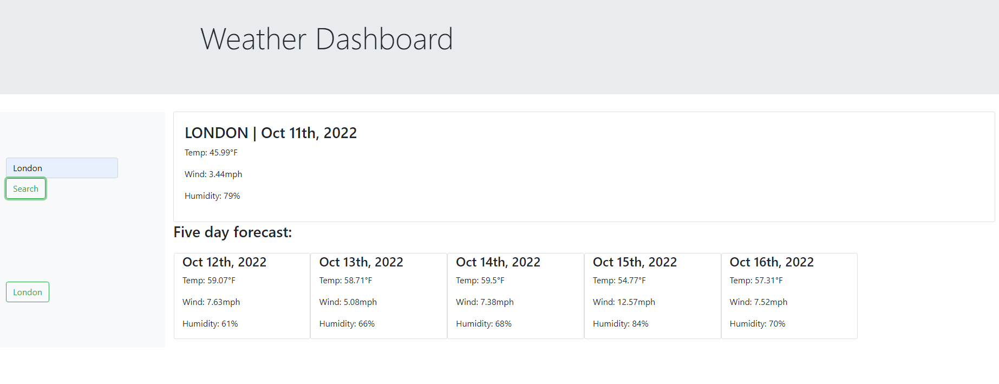

# <Weather Dashboard>

## Description

This site will allow the user to search for a city and obtain the current weather conditions as well as the future 5 day forecast.

## Installation

Site can be viewed at https://alices9.github.io/weather-dashboard/

## Usage

User can input a city name and hit the search button. The current weather as wel as the weather over the next 5 days will populate to the right. User can view the temperatures, wind speeds, and humidity levels.

## Credits

This page was created with
Bootstrap https://getbootstrap.com/
Moment.js https://momentjs.com/
OpenWeather API https://openweathermap.org/
